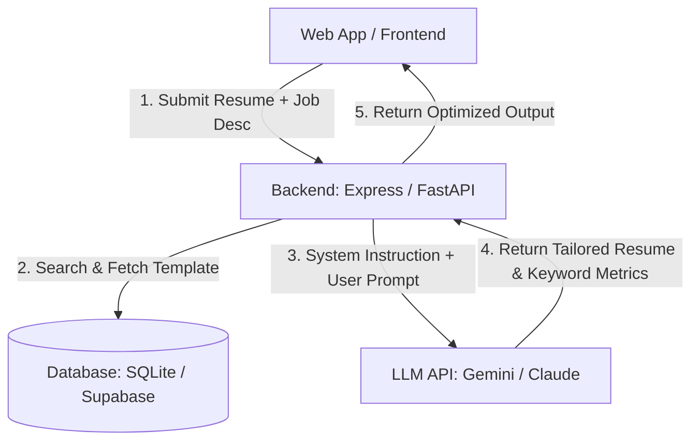

# Blueprints: Resume ATS Tailor Tool

This is a premium, ready-to-code frontend template for an **AI-powered Resume Tailoring Tool**. The interface is pre-built with CSS styling and interactive JS simulations, so you can focus on writing the AI agent logic and database storage.

## Recommended Architecture



---

## 🛠️ Step-by-Step Implementation Guide

Follow these steps using Antigravity / Claude Code to build out the backend:

### 1. Initialize Server & Dependencies
Initialize a Node.js or Python backend. For example, using Express:
```bash
npm init -y
npm install express dotenv cors google-genai zod
```

### 2. Configure JSON Output Schema
Define the structured schema using Zod so that the LLM returns structured JSON data containing both the rewritten resume and lists of matched/missing keywords:
```javascript
import { z } from 'zod';

const ResumeTailorResponse = z.object({
  originalScore: z.number().describe("Initial alignment score (0-100)"),
  optimizedScore: z.number().describe("Target alignment score after edits (0-100)"),
  missingKeywordsAdded: z.array(z.string()).describe("List of keywords added to match job description"),
  matchedKeywords: z.array(z.string()).describe("List of pre-existing keywords"),
  optimizedResumeMarkdown: z.string().describe("The fully rewritten and tailored resume text in markdown format")
});
```

### 3. Connect the LLM API
Create a `/api/tailor` endpoint that runs the model:
```javascript
import { GoogleGenAI } from '@google/genai';
const ai = new GoogleGenAI({ apiKey: process.env.GEMINI_API_KEY });

app.post('/api/tailor', async (req, res) => {
  const { resume, jobDescription } = req.body;
  
  const response = await ai.models.generateContent({
    model: 'gemini-2.5-pro', // Pro is recommended for complex reasoning/rewriting tasks
    contents: `Tailor this resume: \n${resume}\n\nTo match this Job Description:\n${jobDescription}`,
    config: {
      responseMimeType: "application/json",
      responseSchema: ResumeTailorResponse,
      systemInstruction: "You are an expert HR recruiter and ATS optimizer. Rewrite the resume summary and bullets to organically weave in missing technical keywords from the job description without exaggerating experience."
    }
  });

  res.json(JSON.parse(response.text));
});
```

---

## 🚀 How to Run locally
Simply open `index.html` in your browser, or spin up a local development server:
```bash
npx live-server .
```
