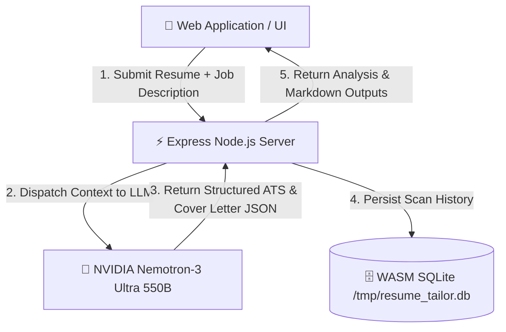

# 🚀 TailorFit.ai — Real-Time AI Resume ATS Optimizer & Cover Letter Engine

[](https://03resumetailortool.vercel.app)
[](https://opensource.org/licenses/MIT)
[](https://nodejs.org)
[](https://sqlite.org)
[](https://integrate.api.nvidia.com)

> **TailorFit.ai** is an enterprise-grade AI career platform that scans applicant resumes against target job descriptions in real-time, calculates multi-metric ATS alignment scores, rewrites bullet points with quantifiable achievements, extracts missing keywords, and automatically generates tailored executive cover letters.

---

## 🌟 Key Features

- **⚡ Real-Time ATS Score Calculation**: Instant comparison of original ATS match score vs. optimized target score (e.g. 48% ➡️ 94%).
- **📊 4-Metric Sub-Score Breakdown**:
  - 🔑 **Keyword Match %**
  - 📐 **ATS Formatting Score %**
  - 📊 **Quantified Metrics %**
  - 🛠️ **Hard Skills Alignment %**
- **✉️ Automated AI Cover Letter Builder**: Generates persuasive 3-paragraph executive cover letters addressed directly to the hiring manager.
- **❌ Missing Keyword Extractor**: Highlights high-impact technical terms missing from the candidate's original resume.
- **📥 Instant Export Options**: Single-click copy for optimized Markdown resume & cover letter + `.txt` file download.
- **💡 Quick-Start Template Presets**: Built-in 1-click presets for Software Engineers and Product Managers.
- **🛡️ Serverless Persistent Storage**: Embedded WASM SQLite database with zero-setup JWT authentication.

---

## 🏗️ System Architecture



---

## 🚀 Live Demo & Deployment

- **Live Web App**: [https://03resumetailortool.vercel.app](https://03resumetailortool.vercel.app)
- **Local Port**: `http://localhost:3002`

---

## 🛠️ Tech Stack

- **Frontend**: Vanilla HTML5, CSS3 (Modern Light Glassmorphism), JavaScript (ES6+)
- **Backend**: Node.js, Express.js
- **Database**: SQLite (via `sql.js` WASM engine for serverless compatibility)
- **Authentication**: JSON Web Tokens (JWT) + `bcryptjs`
- **AI Gateway**: OpenAI SDK / NVIDIA Nemotron-3 Ultra 550B (OmniRoute API)
- **Hosting**: Vercel Serverless Functions (`@vercel/node`)

---

## 💻 Local Setup & Installation

1. **Clone the Repository**:
   ```bash
   git clone https://github.com/voidreformer/tailorfit-ai.git
   cd tailorfit-ai
   ```

2. **Install Dependencies**:
   ```bash
   npm install
   ```

3. **Configure Environment Variables**:
   Create a `.env` file in the root directory:
   ```env
   PORT=3002
   JWT_SECRET=your_jwt_secret_here
   OMNIROUTE_GATEWAY_URL=https://integrate.api.nvidia.com/v1
   OMNIROUTE_API_KEY=your_nvidia_api_key
   MODEL_NAME=nvidia/nemotron-3-ultra-550b-a55b
   ```

4. **Run Development Server**:
   ```bash
   npm start
   ```
   Open `http://localhost:3002` in your browser.

---

## 🛰️ API Endpoints

| Method | Endpoint | Description | Auth Required |
| :--- | :--- | :--- | :--- |
| `POST` | `/api/analyze` | Scans resume against job description, optimizes bullets & generates cover letter | Optional Token |
| `GET` | `/api/history` | Retrieves past saved resume scans from WASM SQLite DB | Optional Token |
| `DELETE` | `/api/history/:id` | Deletes a saved scan record by ID | Required |
| `POST` | `/api/auth/register` | Registers a new user account | No |
| `POST` | `/api/auth/login` | Authenticates user and returns JWT token | No |
| `GET` | `/api/auth/me` | Fetches current user profile details | Required |

---

## 📜 License

Distributed under the **MIT License**. See `LICENSE` for more information.
